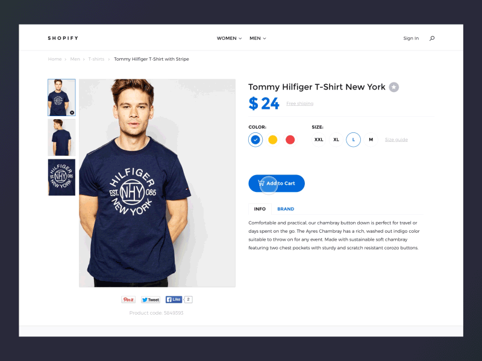

# Quickbeam.js

Animated cart for Shopify.com templates.
This plugin is made for Shopify.com but It should not be problem convert it to other e-commerce, if you want fork this repo. :)

####Demos

* [Live Demo 1](https://g.ents.co/collections/frontpage/products/shirt-no-2)


---

## Installation on Shopify.com

Download [this repo](dist/ https://github.com/greenwoodents/quickbeam.js/archive/master.zip).
Import `dist/quickbeam.min.js` and `dist/quickbeam.scss` files to your Shopify `assets/` folder.
File `dist/quickbeam.liquid` import in to `templates/` folder.

Add this `<script>` tag before closing `</body>` tag in your `layout/template.liquid` file.
``` javascript
<script src="https://cdnjs.cloudflare.com/ajax/libs/gsap/1.18.0/TweenMax.min.js"></script>
{{ 'quickbeam.min.js' | asset_url | script_tag }}
<script>
  var cart = Quickbeam.init({
    'animationLib': 'gsap',
    'variantSelector': function () {
      // Return selected variant
    }
  });
</script>
```

## Options

All of available options.

``` javascript
{
  'animationLib': 'gsap',
  'variantSelector': function () {
    // Return selected variant
  }
}
```

### animationlibrary

If you are using [GSAP](https://github.com/greensock/GreenSock-JS), you can use this animation library with Quickbeam. Pass this parameter to init function. If not vanilla javascript animation is used.
``` javascript
  'animationLib': 'gsap' //Or falling to vanilla js animation.
```

### variantSelector

If you have special selector of variant type in your e-commerce and default function is not able to select variant for you. You can make your own selector and return variant.

Expecting `string` in `return`;
``` javascript
  'variantSelector': function () {
    // Return selected variant in string.
  }
```
## Browser Support

Quickbeam depends on the following browser APIs:

* [classList](https://developer.mozilla.org/en-US/docs/Web/API/Element/classList)
* ES5 array methods: [forEach](https://developer.mozilla.org/en-US/docs/Web/JavaScript/Reference/Global_Objects/Array/forEach)
* [requestAnimationFrame](https://developer.mozilla.org/en-US/docs/Web/API/window/requestAnimationFrame)

It supports the following natively:

* Chrome 24+
* Firefox 23+
* Safari 6.1+
* Opera 15+
* Edge 12+
* IE 10+
* iOS Safari 7.1+
* Android Browser 4.4+

To support older browsers, consider including [polyfills/shims](https://github.com/Modernizr/Modernizr/wiki/HTML5-Cross-Browser-Polyfills) for the APIs listed above. There are **no plans to include any in the library**, in the interest of file size.

## Development

Install development dependencies
```
npm install
```
Run gulp.js
```
gulp
```

## Contributing

Feel free to open pull request.

## Authors

* **Filip Danisko** - *Rework* - [filipdanisko](https://github.com/filipdanisko)
* **Petr Goca** - *Initial work and demo page* - [petr-goca](https://github.com/petr-goca)

See also the list of [contributors](https://github.com/greenwoodents/quickbeam.js/contributors) who participated in this project.

## License

This project is licensed under the MIT License - see the [LICENSE.md](LICENSE.md) file for details


